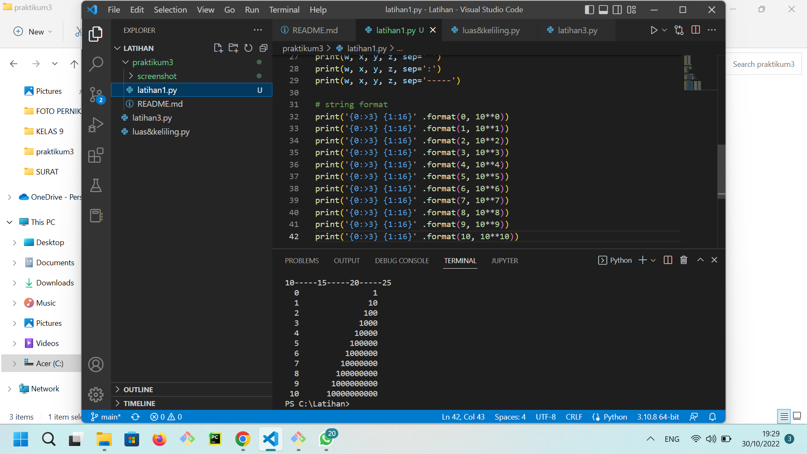
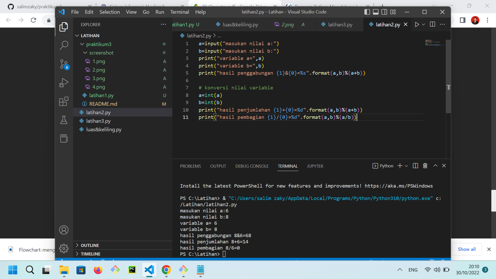
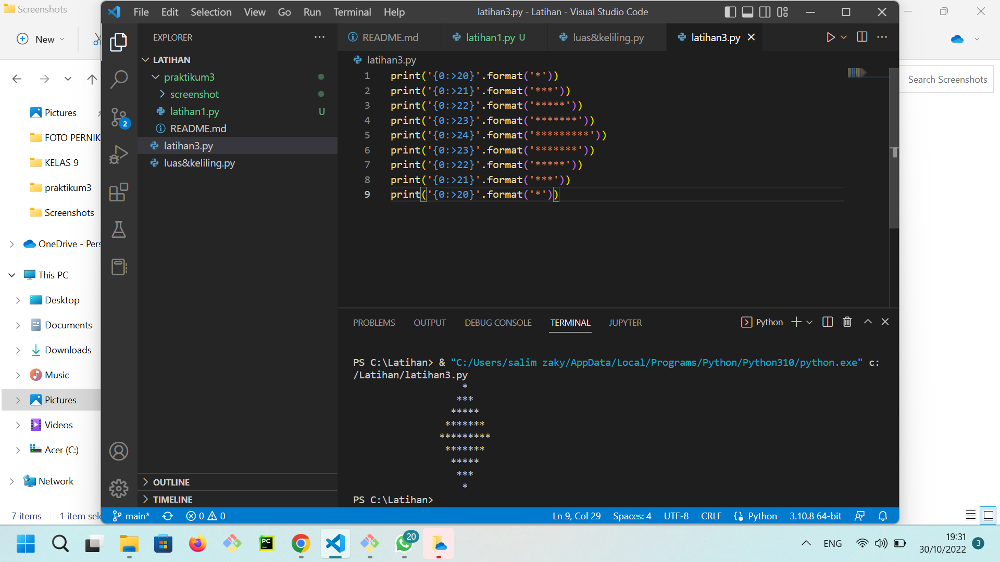
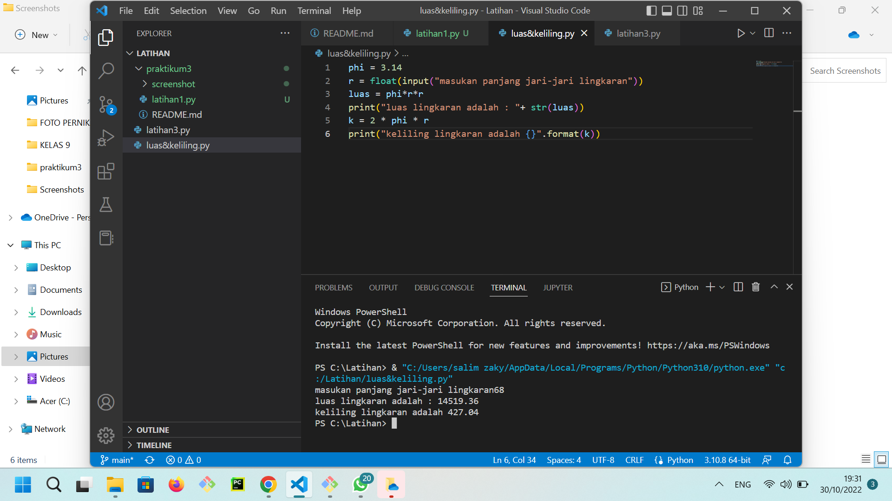

## PRAKTIKUM 3
# Flowchart program menghitung luas dan keliling lingkaran
Bentuk flowchart dari program menghitung luas dan keliling lingkaran

# Latihan 1
Hasil dari latihan 1

# latihan 2
hasil dari latihan 2

# latihan 3
hasil dari latihan 3

# luas keliling lingkaran
hasil dari menghitung luas dan keliling lingkaran
